# Shell360

  

  <a href="./README.md">English</a> | 简体中文

  Shell360 是一款 跨平台的 SSH & SFTP 客户端，支持 Windows、macOS、Linux、Android 和 iOS。
无论是远程开发、服务器管理，还是安全文件传输，Shell360 都能为你提供一致、流畅且安全的使用体验。

## 下载

下载适用于您平台的最新版本 Shell360：

加入我们的 [TestFlight](https://testflight.apple.com/join/teqJZCRm) 测试计划，抢先体验新功能。

## 功能特性

### 🔐 安全连接

- 高级 SSH 客户端，支持多种认证方式
- ED25519、RSA 和 ECDSA SSH 密钥
- 应用数据加密存储，增强安全性

### 📁 文件管理

- 强大的 SFTP 客户端，支持文件传输

### 🔄 端口转发

- 本地端口转发
- 远程端口转发
- 动态端口转发（SOCKS 代理）

### 🎨 自定义主题

- 明暗主题切换支持
- 内置 6 种终端主题
- 支持自定义终端字体

### 💻 跨平台兼容

- 在 Windows、macOS、Linux、Android 和 iOS 上提供一致的体验
- 支持导入/导出应用配置，方便在不同设备之间同步设置

## 技术栈

Shell360 采用现代技术构建：

- **前端**: TypeScript, React
- **后端**: Rust
- **框架**: Tauri（用于跨平台支持）
- **SSH 实现**: 自定义 Rust SSH 插件
- **数据存储**: 加密本地存储

## 截图展示

### 桌面端

#### 主机管理

| 主界面                                                       | 添加主机                                                  |
| ------------------------------------------------------------ | --------------------------------------------------------- |
| 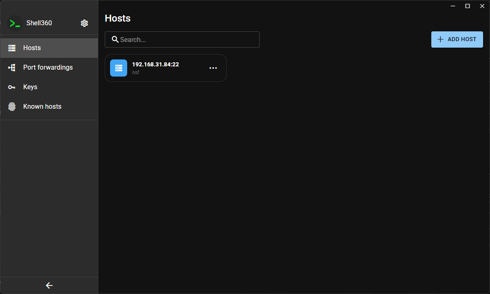 | 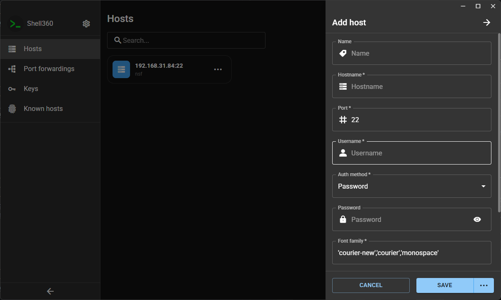 |

#### 端口转发

| 端口转发列表                                                          | 添加端口转发                                                             |
| --------------------------------------------------------------------- | ------------------------------------------------------------------------ |
| 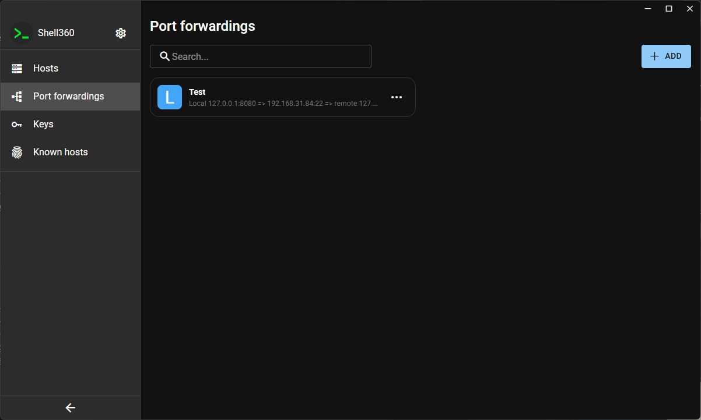 | 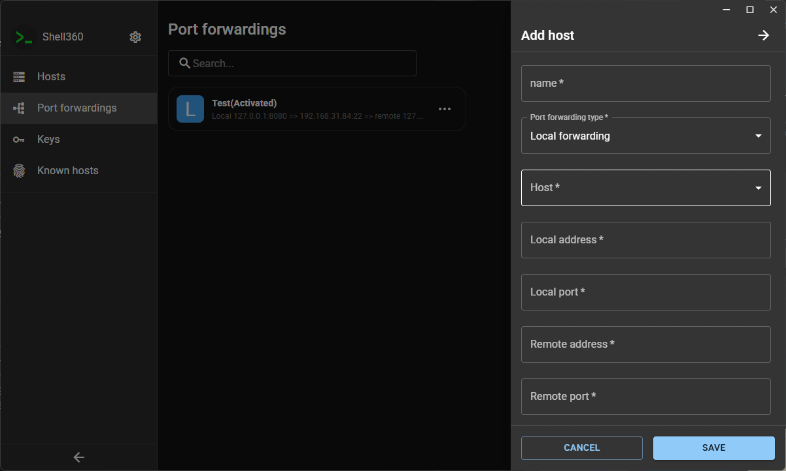 |

#### 密钥管理

| 密钥列表                                              | 添加密钥                                                 | 生成密钥                                                      |
| ----------------------------------------------------- | -------------------------------------------------------- | ------------------------------------------------------------- |
| 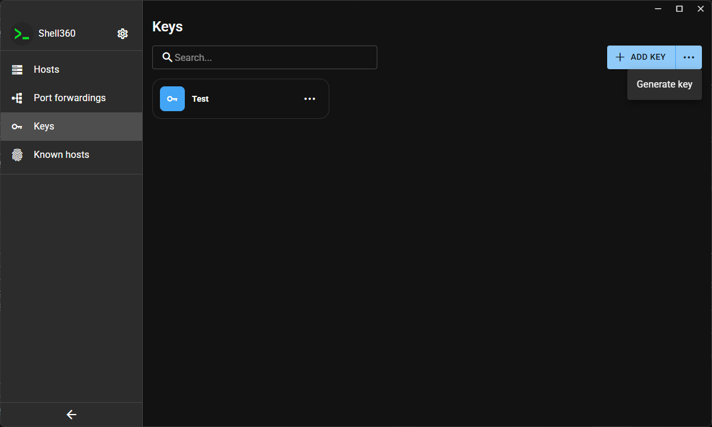 |  | 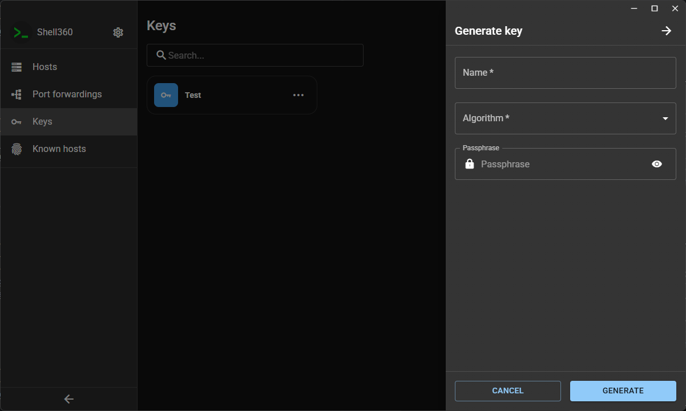 |

#### 已知主机

| 已知主机列表                                                    | 删除已知主机                                                          |
| --------------------------------------------------------------- | --------------------------------------------------------------------- |
| 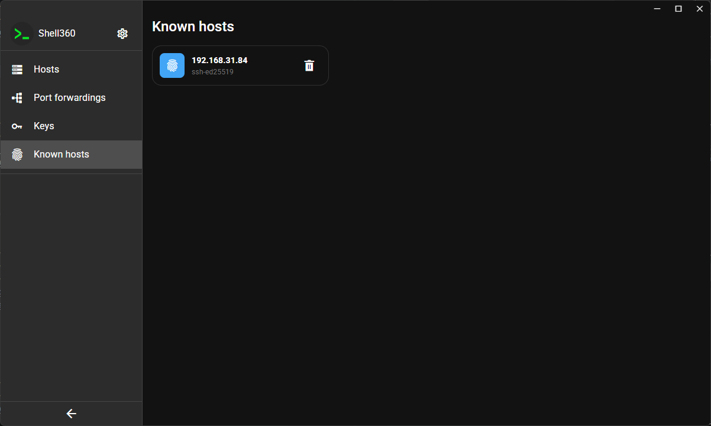 | 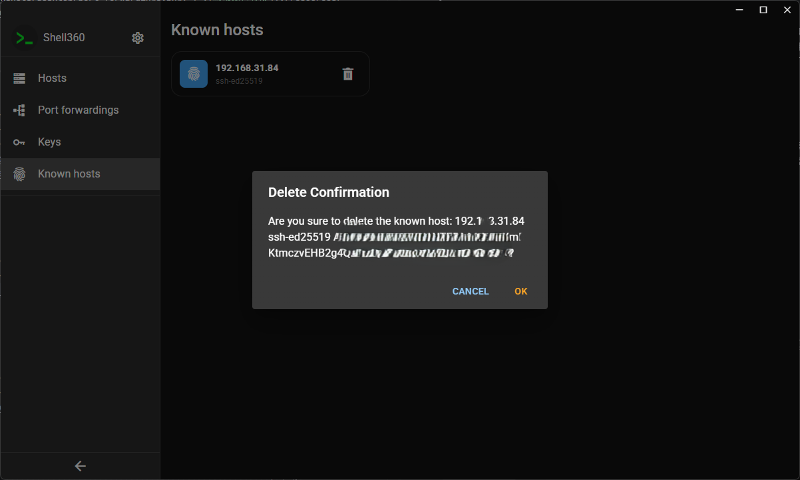 |

#### 终端和 SFTP

| SSH 终端                                                  | SFTP 浏览器                                              |
| --------------------------------------------------------- | -------------------------------------------------------- |
| 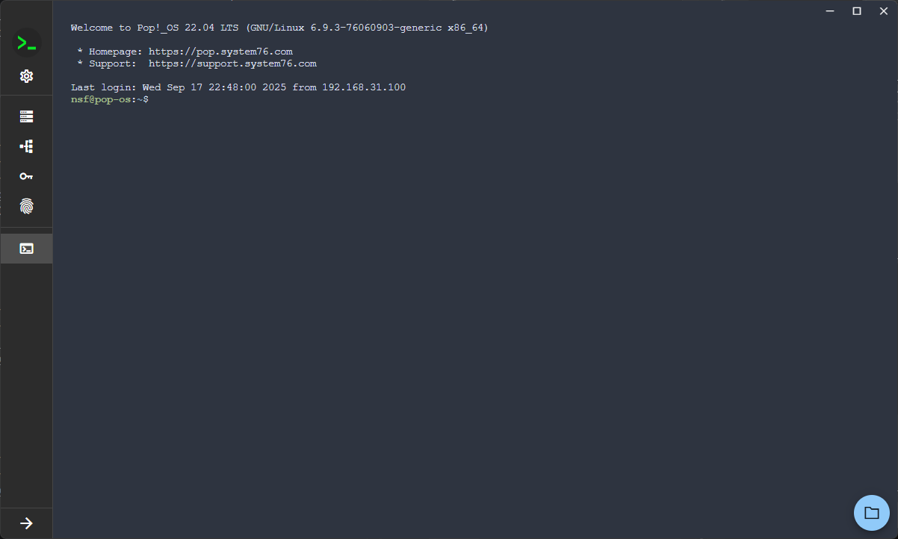 | 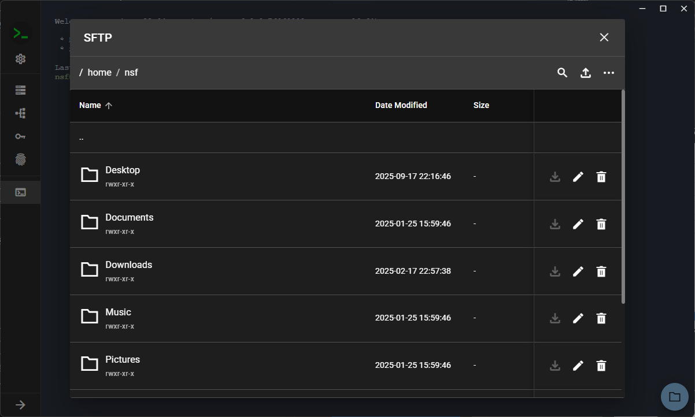 |

### 移动端

#### 主机和密钥

| 主机列表                                                  | 添加主机                                                    | 密钥列表                                                 | 添加密钥                                                   | 生成密钥                                                        |
| --------------------------------------------------------- | ----------------------------------------------------------- | -------------------------------------------------------- | ---------------------------------------------------------- | --------------------------------------------------------------- |
|  |  |  |  |  |

#### 终端和 SFTP

| SSH 终端                                                      | SFTP 浏览器                                                  |
| ------------------------------------------------------------- | ------------------------------------------------------------ |
|  |  |

### 终端主题

| Nord Dark                                                           | Nord Light                                                            | Solarized Dark                                                                | Solarized Light                                                                 | Tango Dark                                                            | Tango Light                                                             |
| ------------------------------------------------------------------- | --------------------------------------------------------------------- | ----------------------------------------------------------------------------- | ------------------------------------------------------------------------------- | --------------------------------------------------------------------- | ----------------------------------------------------------------------- |
| 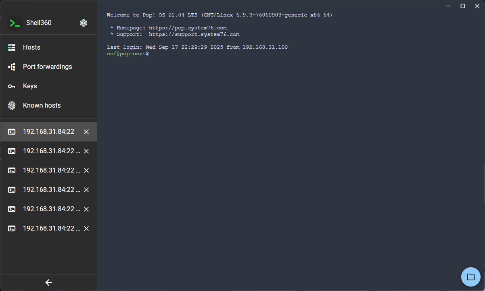 |  | 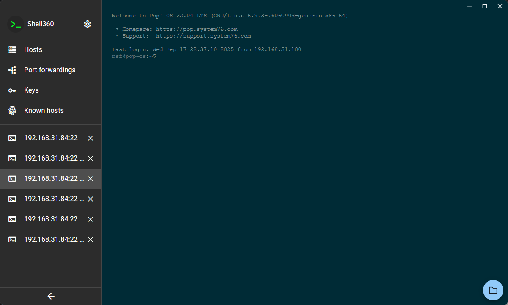 | 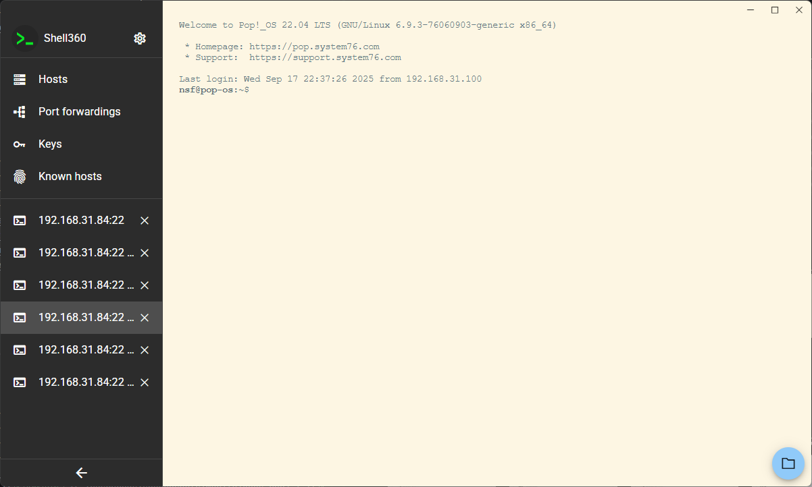 | 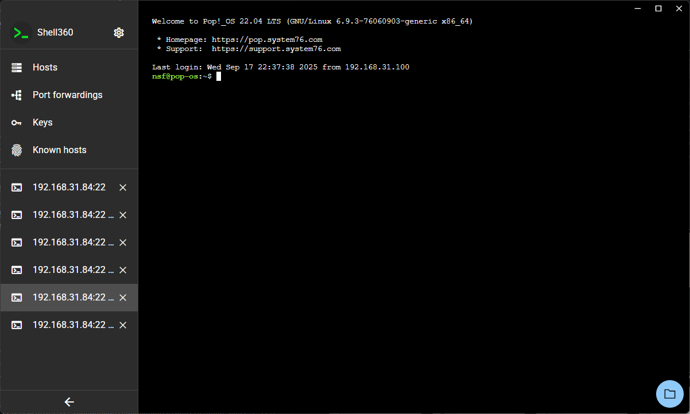 | 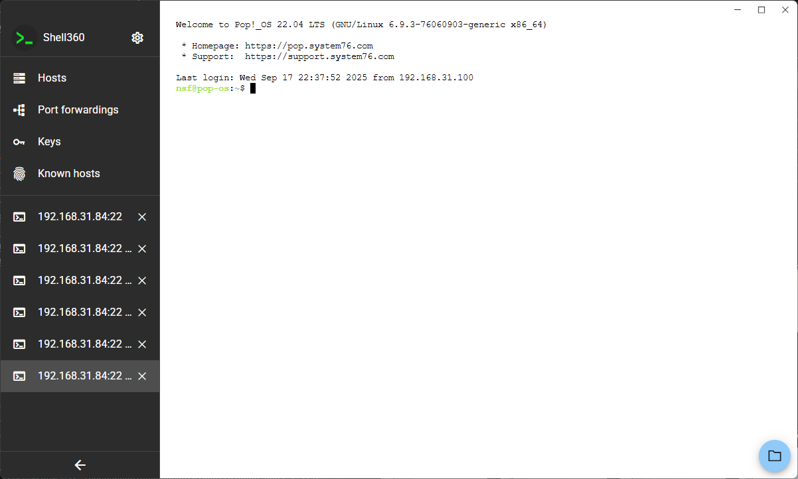 |

## 隐私政策

您的隐私对我们很重要。请查看我们的 [隐私政策](./docs/Privacy-Policy-zh_CN.md) 了解我们如何处理您的数据。

## 贡献指南

我们欢迎社区贡献！请阅读我们的 [贡献指南](./docs/CONTRIBUTING-zh_cn.md) 了解如何开始。

## 许可证

本项目根据 GNU 通用公共许可证 v3.0（GPLv3）的条款授权。
有关详细信息，请参阅 [LICENSE](./LICENSE) 文件。

SPDX-License-Identifier: GPL-3.0-or-later
